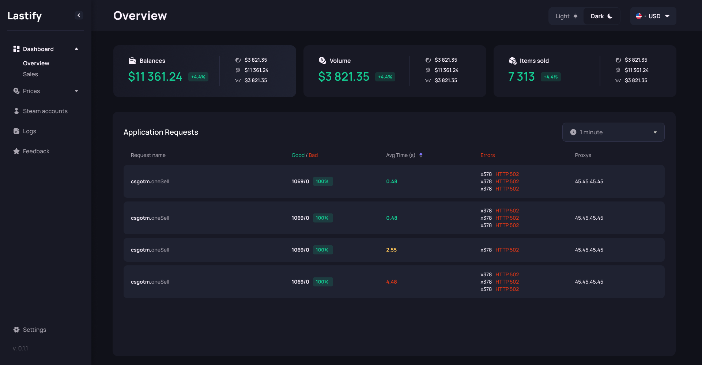
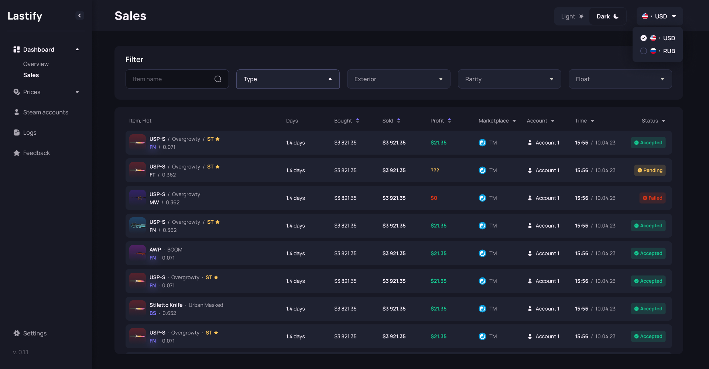
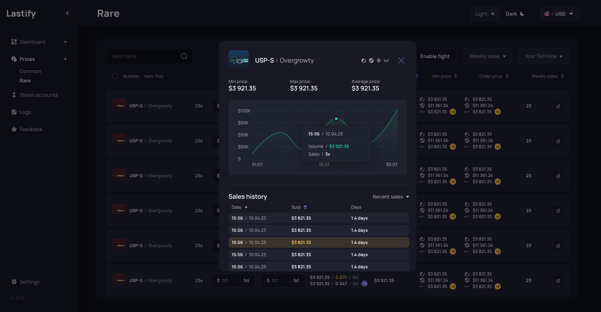
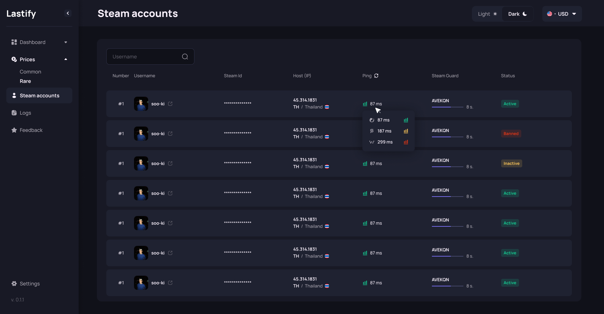
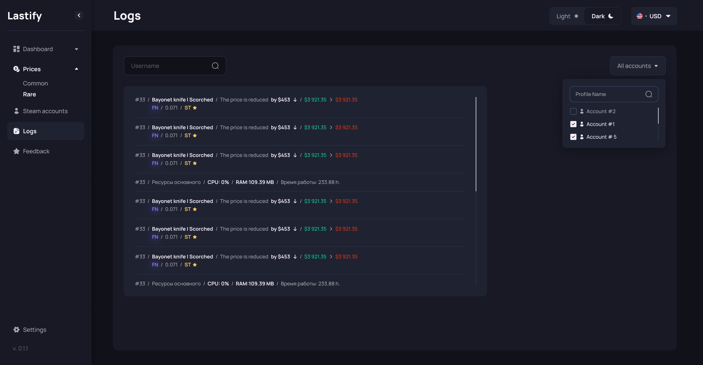

# Lastify

Данный сайт представляет собой админ-панель, на которой пользователь может посмотреть информацию о последних сделках на сайте, об аккаунтах, статистику покупок/продаж, логи сайта, также оставить обратную связь и изменить настройки сайта.

На сайте присутствует тёмная/светлая тема, навигация, различные модальные окна.

## Стек технологий:
- ReactJS
- React-Router-DOM
- SCSS

## Скриншоты сайта:
- Страница "Overview"

- Страница "Sales"

- Страница "Common"

- Страница "Accounts"

- Страница "Logs"
